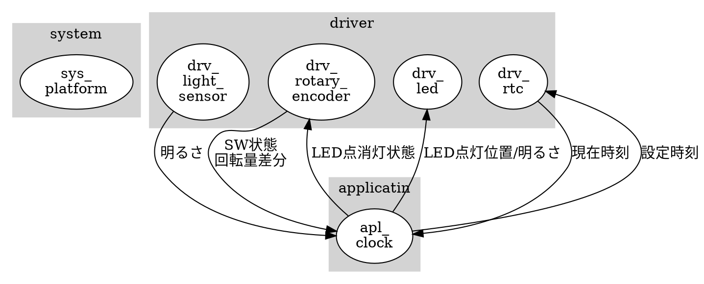

# 要件

- LEDに時刻を表示
- ロータリーエンコーダで時刻設定
- 周囲の明るさでLED輝度調整

# アーキテクチャ

- sys_platform
- drv_led
- drv_light_sensor
- drv_rotary_encoder
- drv_rtc
- apl_clock

```dot
    digraph {
		graph [
			style = "filled"
		]

		node [
			style="filled"
			fillcolor=white
		]

		subgraph cluster_sys {
			label="system"
			penwidth=0
			s_p [label="sys_\nplatform"]
		}

		subgraph cluster_drv {
			label="driver"
			penwidth=0
			d_l [label="drv_\nled"]
			d_ls [label="drv_\nlight_\nsensor"]
			d_re [label="drv_\nrotary_\nencoder"]
			d_r [label="drv_\nrtc"]
		}

		subgraph cluster_apl {
			label="applicatin"
			penwidth=0
			a_c [label="apl_\nclock"]
		}
		
		d_re -> a_c [label="SW状態\n回転量差分"]
		a_c -> d_re [label="LED点消灯状態"]
		d_ls -> a_c [label="明るさ"]
		a_c -> d_l  [label="LED点灯位置/明るさ"]
		d_r -> a_c  [label="現在時刻"]
		a_c -> d_r  [label="設定時刻"]

    }
```
